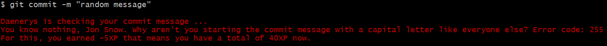

# The gamified git hook to check commit messages.



Features:

* Stops you ever accidentally committing bad temporary changes.
* Is gamified, collect XPs for nice commit messages and get reprimand when you write wrong ones.
* Installs in any project with a single command
* Is easily extendable and custom themes can be added (the bease version is in the style of Linus Torwalds)
* Is well tested. See [tests/test-hook.bats](https://github.com/pimterry/git-confirm/blob/master/test/test-hook.bats#L40-L9999).
* Works on Linux, OSX and Windows ([in Powershell at least](https://twitter.com/afnpires/status/768403583263973376)).
* It is based on the wonderful [git confirm by Tim Perry]((https://github.com/pimterry/git-confirm/)

## To Install
In the root of your Git repository, run:

```bash
curl https://github.com/agostontorok/LinusCommitMessageChecker/blob/master/hook.sh > .git/hooks/commit-msg && chmod +x .git/hooks/commit-msg
```

All done. If you want to check it's installed correctly you can run:

```bash
echo "TODO" > ./test-git-confirm
git add ./test-git-confirm

# Should prompt you to confirm added 'TODO'. Press 'n' to cancel commit.
git commit -m "not so nice commit message"
```

## Contributing
Want to file a bug? That's great! Please search issues first though to check it hasn't already been filed, and provide as much information as you can (your OS, terminal and Git-Confirm version as a minimum).

Want to help improve the Linus Commit Message Checker?

* Check out the project:
  `git clone --recursive https://github.com/agostontorok/LinusCommitMessageChecker.git`

  (Note 'recursive' - this ensures submodules are included)
* Check the tests pass locally: `./test.sh`
* Add tests for your change in test/test-hook.bats

  Check out the [BATS](https://github.com/sstephenson/bats) documentation if you're not familiar with it, or just crib from the existing tests.
* Add any documentation required to this README.
* Commit and push your changes
* Open a PR!
